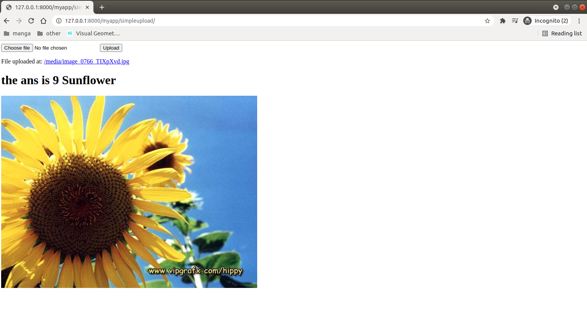

README.md

OBJECTIVE AND PURPOSE:
This repo is a basic django application that runs an AI neural network tensorflow model specifically the flower network
Note that this looks ugly and basic because that is intentional. We are removing everything and keepit ing basic to illustrate 
it is meant to be that way to simple be as basic as possible
to illustrate how to setup your neural network model inside a django applicatoin.

STEPS TO RUN:
1. download the repo from git
2. cd into the deploy folder
3. If you need run and install the libraries from the requirements file via this command  pip install -r requirements.txt
4. run python manage.py runserver
5. This will now run the server locally
6. go to localhost url http://127.0.0.1:8000/myapp/simpleupload/
7. upload your picture and your done and click upload

If everything is perfect you should see the following screenshot like I do on  your local url

NOTE: you can paste your own flower h5 file into the project and use that instead.
- Most important file is views.py as that is where all the magic is happening.
- Please note the labels may be mislabelled. I simply took the names from the image from the data set website. So I don't know whether 0=Buttercup or not.
Line 43 in views.py lists the list of all the 17 flower and possible its wrongly named.  

The flower images are located in this url you can download the zip file from there
https://www.robots.ox.ac.uk/~vgg/data/flowers/17/index.html

I have attached and given some sample images from here for you to test and play with if need be
I noticed that sunflower seems to be the best results for my neural network but it is a very unique flower from the 17 flowers in the dataset

TODO:
run on aws at some point

